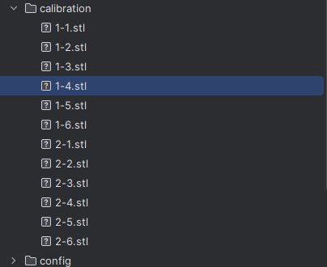
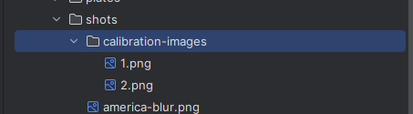

# Adding Athena Calibration Models

To add new calibration models to the Athena, there are a few key places that need to be updated.
They are all within the code base but should be relatively simple to update. For each new model, follow these steps

## Editing the config

You will need to add some data about your new calibration piece to `/public/config/calibrationConfig.json`.
You should add your new item in the following format:

```json5
  {
  // A new numerical ID that is unique to this model. ie. increment from the previous model in the list 
  "id": 2,
  // A name that represents this piece, this will be displayed on the webui and HMI
  "name": "Calibration Model Name",
  // A count of how many models are included in this calibration. For most models this will be 6.
  "models": 6,
  "info": {
    // An estimate of how much resin is required for this print. This is shown to the user on the HMI.
    "resinRequired": 140,
    // The height of the model in microns, this is used to show the user the estimated layer count.
    "height": 40000
  }
}

```

## Adding the STLs

### Generating the STLs

For a new calibration piece, you must first generate the STLs you want. They should have a number modelled into the
piece so that the user can identify it after printing and should be exported with co-ordinate data so that their
locations are preserved.

### Adding to Athena

These STLs should then be placed in the `/public/calibration/` path in this code base. Each STL should be added
individually in the format of `{calibrationModelId}-{numberOfPiece}.stl`, ie `3-1.stl`.

**WARNING**: Due to the way NanoDLP takes this information, the second number is the OPPOSITE way around to what you
think it is. If you have labeled a model "6" then this piece should be `3-1.stl`, and model "1" should be `3-6.stl`.
That way, when the user prints the piece, the model labeled "1" will be the least exposed and "6" will be the most.



## Adding images

One image should be added to `/public/shots/calibration-images/{calibrationModelId}.png`. ie.
`/public/shots/calibration-images/3.png`



## Adding help text

New HTML should be added to `/templates/athena-calibration.html` that describes to the user how to read the calibration
piece. Find the div with the id `model-evaluation-instructions` and inside that add a new div with the id
`model-evaluation-{calibrationModelId}`.
That div should have a class of `evaluation-text` and every ID other than "1" should have a style of `display: none` 
(The JS code will toggle the display when the user selects that item). See an example below:
```html
<div id="model-evaluation-3" class="evaluation-text" style="display: none">
    Check out <a href="google.com" target="_blank">This cool guide</a> for instructions.<br><br>
</div>
```